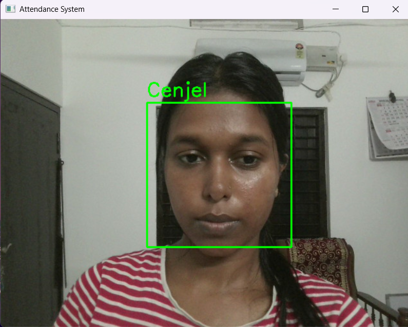
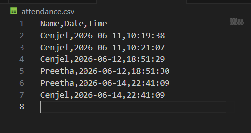
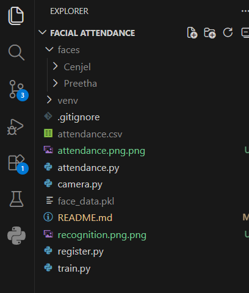

# Facial Attendance System

## 📌 Overview

The Facial Attendance System is a Python-based computer vision project that automates attendance marking using facial recognition. The system captures student faces, trains face data, recognizes faces in real time through a webcam, and records attendance with date and time stamps.

This project was developed to gain hands-on experience in computer vision, image processing, file handling, and real-time webcam applications using Python and OpenCV.

---

## ✨ Features

* Face Registration
* Automatic Face Image Capture
* Face Data Training
* Real-Time Face Detection
* Face Recognition Using Webcam
* Automatic Attendance Logging
* Date and Time Tracking
* CSV-Based Attendance Records

---

## 🛠️ Technologies Used

* Python
* OpenCV
* Pickle
* CSV
* Haar Cascade Classifier

---

## 📂 Project Structure

```text
Facial-Attendance-System/
│
├── screenshots/
│   ├── recognition.png
│   ├── attendance.png
│   └── project-structure.png
│
├── attendance.py
├── register.py
├── train.py
├── camera.py
├── README.md
└── .gitignore
```

---

## ⚙️ How It Works

### Step 1: Register Student

Run:

```bash
python register.py
```

The system captures multiple face images and stores them under the student's name.

### Step 2: Train Face Data

Run:

```bash
python train.py
```

The system processes all registered face images and prepares them for recognition.

### Step 3: Start Attendance System

Run:

```bash
python attendance.py
```

The webcam opens, detects faces, recognizes registered users, and records attendance automatically.

---

## 📊 Attendance Output

Example:

```csv
Name,Date,Time
Cenjel,2026-06-12,10:30:15
Preetha,2026-06-12,10:31:02
```

---

## 📸 Screenshots

### Face Recognition



### Attendance Record



### Project Structure



---

## 🚀 Future Enhancements

* GUI using Tkinter
* Database Integration (SQLite/MySQL)
* Face Recognition using Face Encodings
* Attendance Reports and Analytics Dashboard
* Export Attendance to Excel
* Cloud-Based Attendance Management

---

## 🎯 Learning Outcomes

Through this project, I gained practical experience in:

* Python Programming
* Computer Vision
* OpenCV
* Image Processing
* Real-Time Face Detection
* File Handling and Data Storage
* Git and GitHub Version Control

---

## 👨‍💻 Author

**Cenjel Ajeika**

B.Tech Computer Science and Engineering Student

GitHub: https://github.com/yess-32

LinkedIn: https://www.linkedin.com/in/cenjelajeikam/
